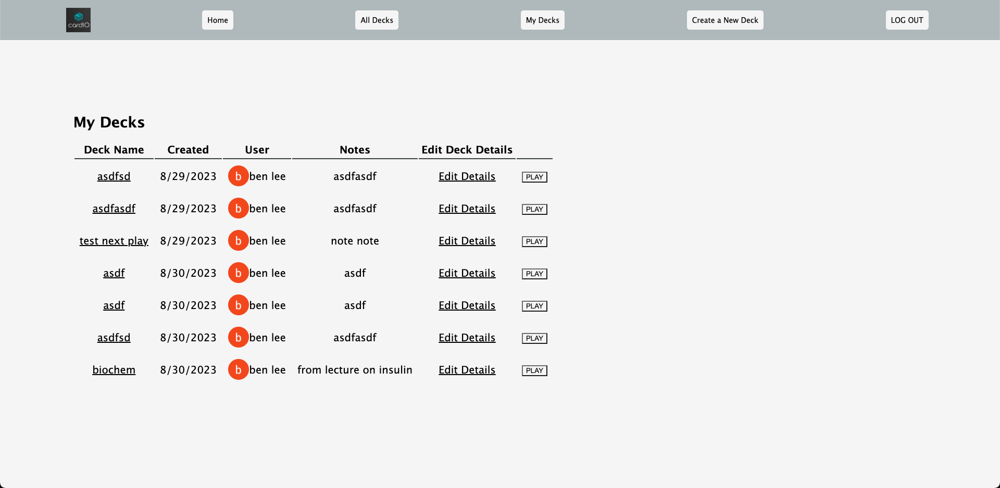
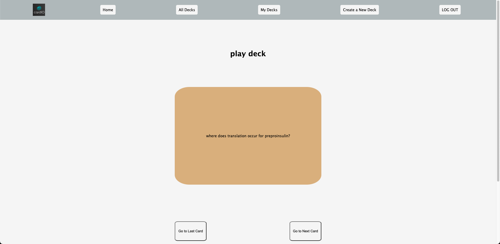

# cardIO 
cardIO is a powerful educational resource designed to draw on high-yield learning from spaced repetition during long study sessions. This app was developed with a focus on efficiency, effectiveness, and user-friendliness, drawing inspiration from popular platforms like Anki and Quizlet. In cardIO, users are able to create their own decks of flashcards and go through each card until they are finished with the deck. Users are also able to view all of the decks created on cardIO and see collections of decks a particular user has made as well. Also, users are encouraged to have discussions on various topics with comments and message boards within both decks and individual cards.  

 

 
 
 
Technologies Used: JavaScript, HTML, CSS, Node.js, Express.js, MongoDB, and Mongoose

## Getting Started:
https://benjaehyun.github.io/sweeper/

Log into your Google account to be able to access full functionality of the cardIO app. 

Once logged in: 
If you want to browse all of the decks that have been previously created on cardIO, navigate to the "All Decks" section of the navigation bar at the top of the page. 
If you want to view the decks that you have created, navigate to the "My Decks" section of the navigation bar. 
If you want to view all of the decks that a particular user has created, simply click on the name of the user in the list of decks in the "All Decks" page. 

In order to edit details of a deck such as the title or author notes, follow the "Edit Details" link. If you want to edit a particular card, find the particular deck using one of the aforementioned methods and click on the deck title. This will display a page with all of the cards within that deck along with a link that will allow you to edit each card as well as a button to add cards near the bottom. 

If you want to leave a comment on a deck or card, navigate to the bottom of either page and simply fill out the input box and click the button. 

## What's Next: 
#### Known Bugs: 
* Throws an error when a card is deleted then user tries to play the deck

#### Additional Features 
* Github inspired functions to clone and merge decks
* Importing large amounts of data/entire decks from .csv or .apkg files 
* Wolfram Alpha/ChatGPT api implementation so that supplemental information can be provided to the user while viewing flashcards or so that the user can ask questions as they're studying
    * Also use ChatGPT api so that a user can paste a whole article or written lession to write flashcards for you 
* Implement infinite play functionality so that users can parse through the deck randomly without a definite end
    * Adjust the deck data model to keep track of a "temperature" so that the user can adjust the temperature with each completion of the card based on their confidence on the topic. This way, cards with a lower "temperature" or confidence score will show up more frequently. 
* Add tags and categories for easier user navigation of all decks, as well the ability for the user to search for decks based on title, categories, or tags. 
    * Also add other QOL navigation features such as filters and sorting 
    * Create different sorting methods such as popularity so that users can list decks by views or upvotes (or some other user endorsement metric)
* Create a heat map similar to the github commit calendar based on the user's daily flashcard completions 

